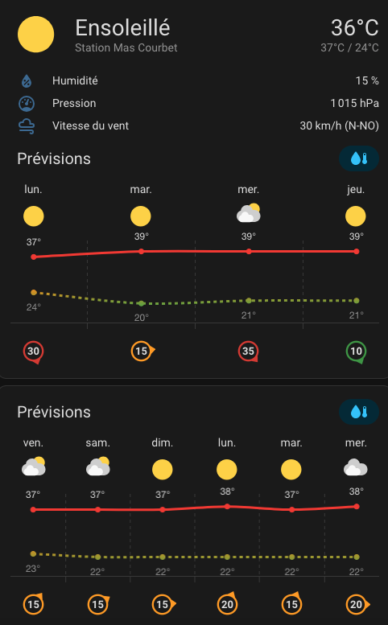

# Meteociel Forecast for Home Assistant

> **Unofficial Home Assistant integration for Meteociel weather forecasts.**

Retrieve weather forecasts directly from **Meteociel** and expose them as a native Home Assistant `weather` entity.

The integration supports multiple forecast models, hourly and daily forecasts, long-range trends, and includes useful agronomic indicators such as **VPD** and **ETP**.

---

<p align="center">
  
</p>

---

## Features

- Native Home Assistant Weather Entity
- Hourly forecasts
- Daily forecasts
- Long-range trend forecasts
- Multiple forecast models
- Multiple integration instances
- Forecast charts compatible
- Temperature
- Humidity
- Pressure
- Wind speed
- Wind gusts
- Wind direction
- Precipitation
- Vapor Pressure Deficit (VPD)
- Daily Reference Evapotranspiration (ETP - Hargreaves)

---

## Supported forecast models

- GFS
- AROME
- AROME 1h
- ARPEGE 1h
- ICON-EU
- ICON-D2
- WRF
- WRF 1h
- Tendances (4–10 days)

---

## Installation

### Manual installation

Copy the folder

```
custom_components/meteociel
```

into your Home Assistant configuration directory.

Restart Home Assistant.

Then go to:

```
Settings
→ Devices & Services
→ Add Integration
→ Meteociel
```

Configure:

- City ID
- City name
- Forecast model

---

## Example

```yaml
type: custom:weather-forecast-card
entity: weather.meteociel_carpentras_gfs
```

---

## Agronomic indicators

### Vapor Pressure Deficit (VPD)

Calculated from hourly forecast temperature and relative humidity.

Useful for:

- Irrigation management
- Greenhouse climate control
- Crop stress monitoring
- Disease risk assessment

---

### Reference Evapotranspiration (ETP)

Estimated using the **Hargreaves equation**.

Useful for:

- Irrigation scheduling
- Crop water demand estimation
- Water balance calculations

> **Note:** ETP values are estimated using the Hargreaves equation and should be considered approximate.

---

## Acknowledgements

A heartfelt thank you to the entire **Meteociel** team and community for maintaining such an outstanding weather website over so many years.

For countless weather enthusiasts, pilots, farmers, gardeners, photographers, researchers and professionals, Meteociel has become an indispensable daily resource. Its remarkable aggregation of multiple weather models, observations, maps and long-range forecasts represents an extraordinary amount of work and dedication.

This integration simply aims to make that information easily accessible within Home Assistant while fully acknowledging and respecting the tremendous work carried out by the Meteociel team.

Thank you for making such an exceptional resource available to the community.

---

## Disclaimer

This project is an **unofficial** Home Assistant integration.

It is **not affiliated with, endorsed by, or sponsored by Meteociel**.

This integration retrieves forecast information made publicly available through the Meteociel website for personal use within Home Assistant.

All weather forecasts, data, trademarks and related content remain the property of **Meteociel** and/or their respective weather model providers.

---

## License

Released under the **MIT License**.

---

## Changelog

See **CHANGELOG.md** for the complete version history.